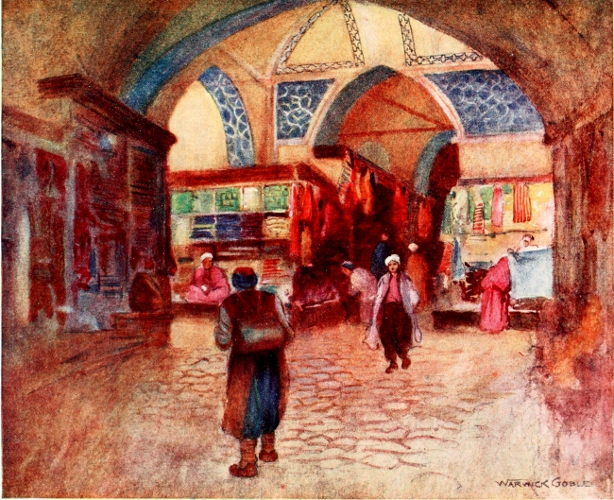

    

  
  
  

  
  
  

# Bazaar

## Overview

Go console application that searches for possible market arbitration paths utilizing pre-approved coin pair swapping paths.  
Possible markets are two, UniswapV2 and SushiSwap.  
Always starts at 1 WETH and attempts to exit with same coin.

## Prerequisites

If you are not using docker, these are required:  

make  
go 1.18+  
solc  
abigen (geth)  

## Environment

For getting a prompt for the required INFURA key and other configs, and creating .env file.  

`make env`  

Alternatively, you may export manually:  

`export BAZAAR_INFURA_KEY=YOURKEY`

## Build & Run

### Make

`make go`  

Alternatively, you may run `make build` and `make run` separately.  
Or run the scripts in `scripts/`.  

Contract ABI for pair reserves is already built but can be recompiled with:  

`make sol`

### Docker

#### Building

`docker build -t patricionapoli/bazaar .` 

#### Running 

First, either create the env file through:

`make env`  

And then:  

`docker run --env-file .env -v "$(pwd)"/output:/go/src/bazaar/output patricionapoli/bazaar`  

Or set the infura API key directly:  

`docker run -e BAZAAR_INFURA_KEY=key -v "$(pwd)"/output:/go/src/bazaar/output patricionapoli/bazaar`  

Please note that the output folder is being mapped to `/output`

#### Running release

`docker run --env-file .env -v "$(pwd)"/output:/go/src/bazaar/output ghcr.io/patricionapoli/bazaar:master`